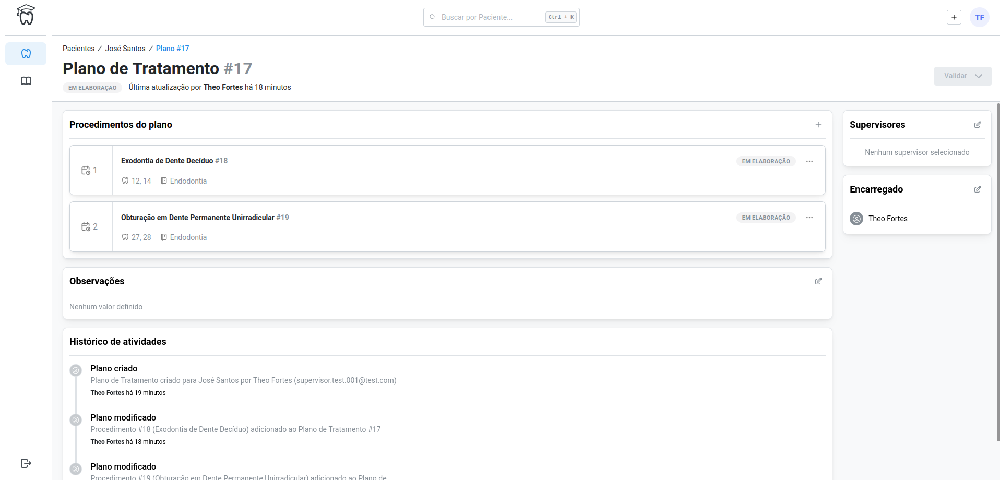
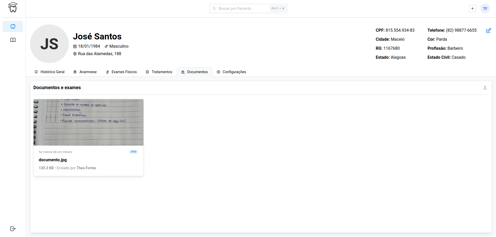
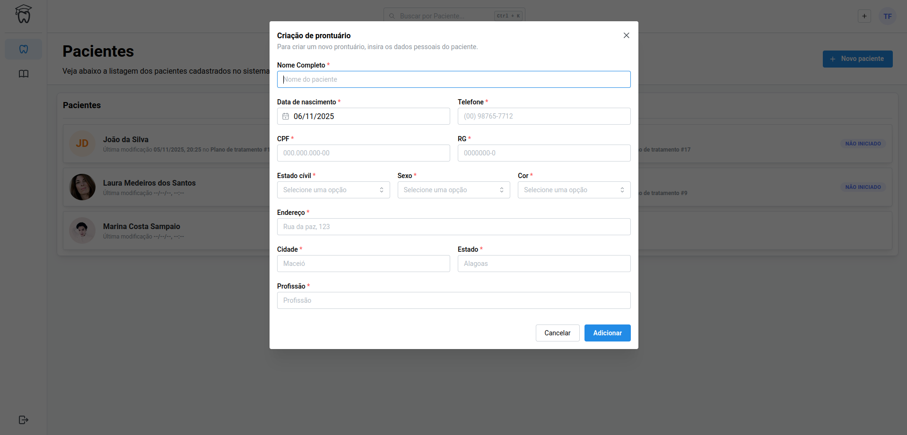
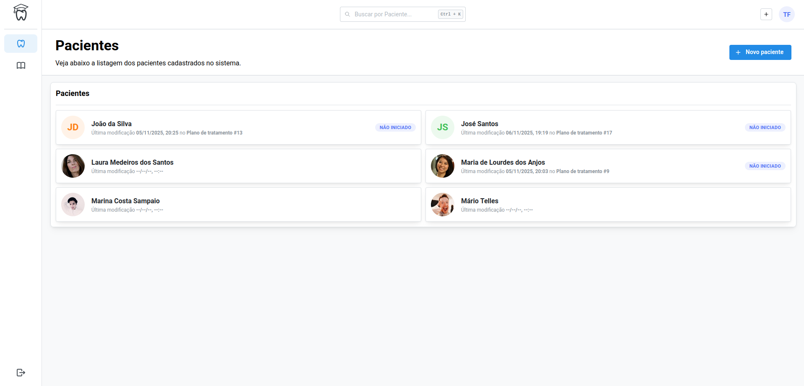
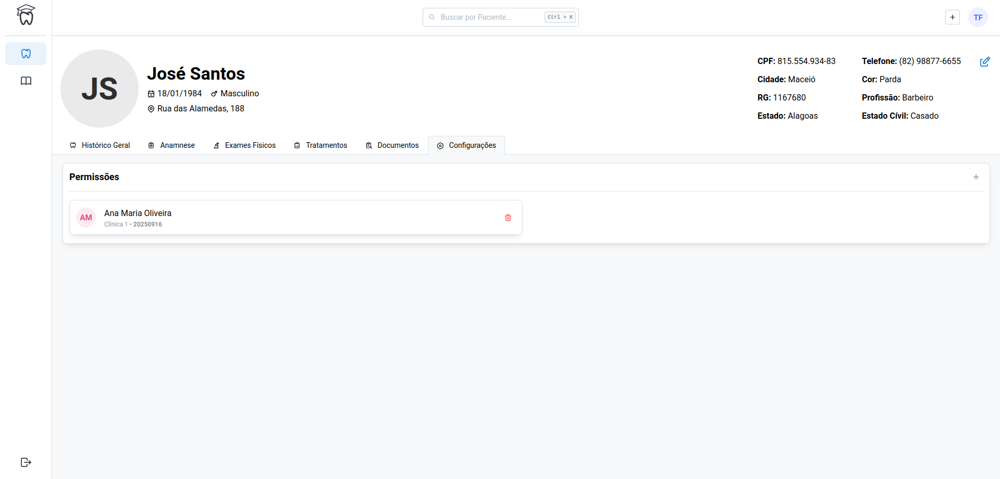
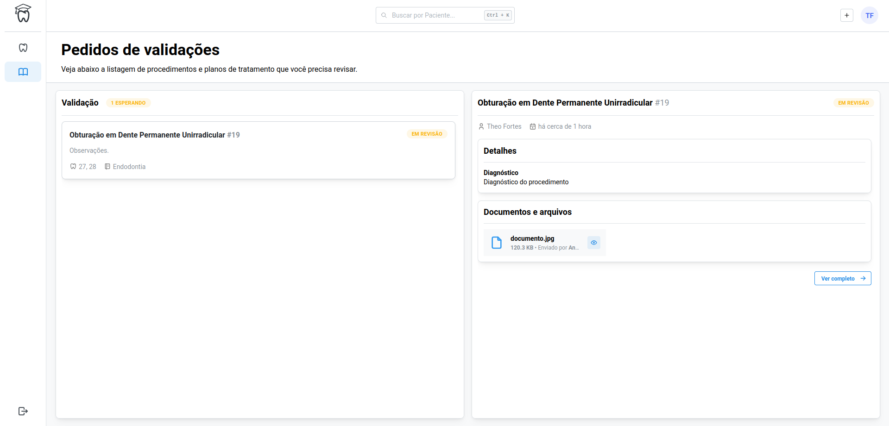

# Odontolog

Uma plataforma de gestão integrada que mapeia o fluxo de atendimento, valida o registro de atividades dos alunos, digitaliza exames e fichas, e controla o acesso seguro aos prontuários, tudo adaptado para uso mobile.


## Features

- Gerenciamento de Usuários e Permissões
- Cadastro de Pacientes
- Registro de Anamnese de Pacientes
- Registro de exames físicos de Pacientes
- Cadastro e gerenciamento de planos de tratamento
- Cadastro e gerenciamento de procedimentos
- Anexo de documentos e exames de um paciente
- Gerenciamento de permissões aluno -> paciente
- Fluxo de validação de artefatos


## Screenshots









## Tecnologias utilizadas

**Frontend:** React, Next.js, Mantine

**Server:** Java, Spring Boot


## Demo

Disponível para teste em: [odontolog.tech](http://odontolog.tech)


## Rodando localmente

### Pré-Requisitos
- Java (JDK 17 ou superior)
- Node.js (v18 ou superior) e npm

### Passos Iniciais

Clone o projeto

```bash
  git clone https://github.com/Odontolog/odontolog
```

Mude para o diretório do projeto

```bash
  cd odontolog
```

### Frontend

Instale as dependências

```bash
  cd frontend
```

```bash
  npm install
```

Inicie o frontend

```bash
  npm run dev
```

### Backend

```bash
  cd server
```

Inicie o backend

```bash
  mvn spring-boot:run
```


## Rodando testes

Para rodar os testes do projeto execute esses comandos

```bash
  cd server
```

```bash
  mvn test
```


## Autores

- [@Arthurpmrs](https://www.github.com/Arthurpmrs)
- [@BeaRoodriguees](https://www.github.com/BeaRoodriguees)
- [@daviromao](https://www.github.com/daviromao)
- [@Faite100](https://www.github.com/Faite100)
- [@KeeOtth](https://www.github.com/KeeOtth)
- [@ricardovinicius](https://www.github.com/ricardovinicius)

